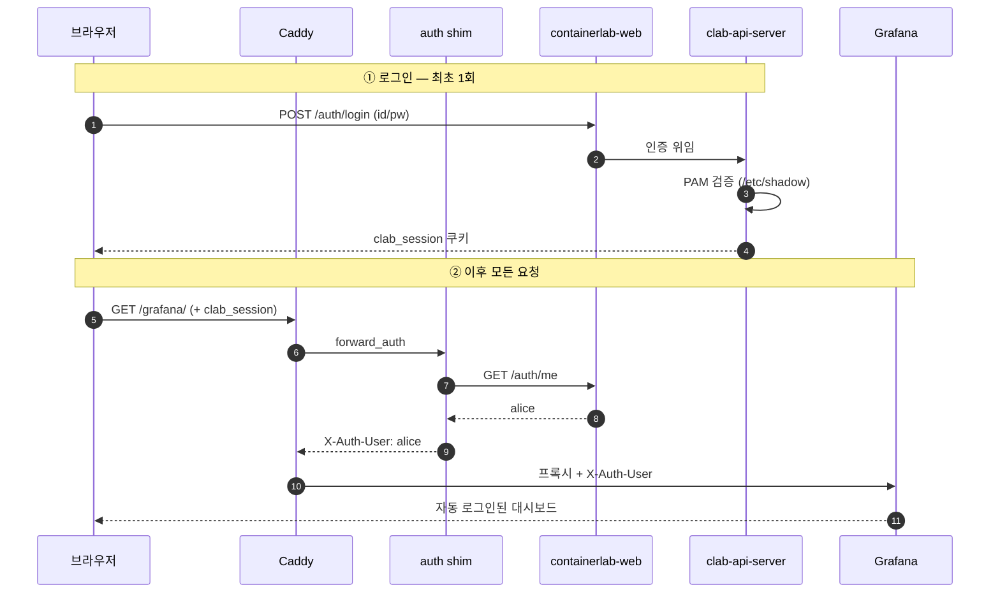

# 로그인

## 로그인은 리눅스 계정 하나로 끝납니다

별도의 편집기 비밀번호도, Grafana admin 계정도 없습니다. 서버 계정의 id/pw 로 한 번 로그인하면 `/clab/`, `/code/`, `/grafana/` 가 모두 열립니다.



* `POST /auth/login` 은 순정 containerlab-web 의 엔드포인트입니다. 인증은 clab-api-server 가 **PAM** 으로 하므로, 비밀번호는 `/etc/shadow` 에 있는 그 비밀번호입니다.
* 로그인 폼(`/login`)은 이 레포의 것입니다. 순정 폼은 "API Endpoint" 와 "Label" 을 묻는데, 서버가 한 대뿐인 자체 호스팅에서는 물어볼 이유가 없어서 `/api/config` 에서 채웁니다.
* `auth/clabhost-auth` 는 쿠키를 사용자 이름으로 번역하는 60줄짜리 프로세스입니다. 비밀번호를 다루지 않으므로 특권이 없습니다.
* Grafana 는 `GF_AUTH_PROXY_ENABLED` 로 `X-Auth-User` 헤더를 신원으로 받습니다. 로그인 폼은 꺼져 있습니다.

클라이언트가 보낸 `X-Auth-User` 는 Caddy 가 프록시 직전에 **무조건 제거합니다.** 그 헤더를 위조하면 임의의 Grafana 계정이 되기 때문입니다.

## 계정 추가

`clab_api` 그룹에 넣으면 로그인할 수 있습니다. 비밀번호가 없는 계정은 PAM 이 통과시키지 않습니다.

```sh
sudo useradd --create-home --shell /bin/bash alice
sudo passwd alice
sudo usermod -aG clab_api alice
```

랩을 실제로 운용하려면 `docker` 와 `clab_admins` 도 필요합니다. **이 둘은 호스트 root 와 동등합니다** — [설치 상세](install.ko.md#권한-모델) 를 보십시오.

```sh
sudo usermod -aG docker,clab_admins alice
```

## 로그인은 여러 명, 작업 공간은 하나

clabhost 는 **1인용** 입니다. 로그인은 계정별로 하지만 그 뒤는 전부 공유합니다.

| | |
| --- | --- |
| 편집기 | 호스트에 하나. `.env` 의 `CLAB_USER` 계정으로 동작하고 그 사람의 `~/clab` 을 엽니다. 누가 로그인해도 같은 파일을 보고, **터미널은 그 계정의 호스트 셸입니다** |
| 랩 | `clab_admins` 는 남의 랩도 조작할 수 있습니다 |
| 호스트 포트 | 랩이 직접 점유합니다. 두 사람이 같은 예제를 동시에 실행할 수 없습니다 |

여러 사람에게 계정을 주더라도 **서로 신뢰하는 관계**여야 합니다. 그렇지 않다면 각자 호스트를 하나씩 쓰십시오. 이유는 [README](../README.ko.md#유의사항) 에 있습니다.

## 세션 만료

로그인 세션은 24시간입니다(`www/login.html` 의 `SESSION_DURATION`). containerlab-web 은 세션을 메모리에 두므로 **컨테이너를 재시작하면 전원이 로그아웃됩니다.** `docker compose up -d` 가 이미지 변경으로 컨테이너를 재생성할 때도 마찬가지입니다.

clab-api-server 가 발급한 JWT 는 `JWT_EXPIRATION`(기본 24h)까지 유효합니다. 계정을 즉시 끊어야 하면 그룹에서 빼는 것만으로는 부족하고 API 서버의 `JWT_SECRET` 을 교체해야 합니다.

---

어느 주소로 무엇이 열리고 어디에 인증이 걸리는지는 [URL 과 프록시](urls.ko.md) 에 있습니다.
